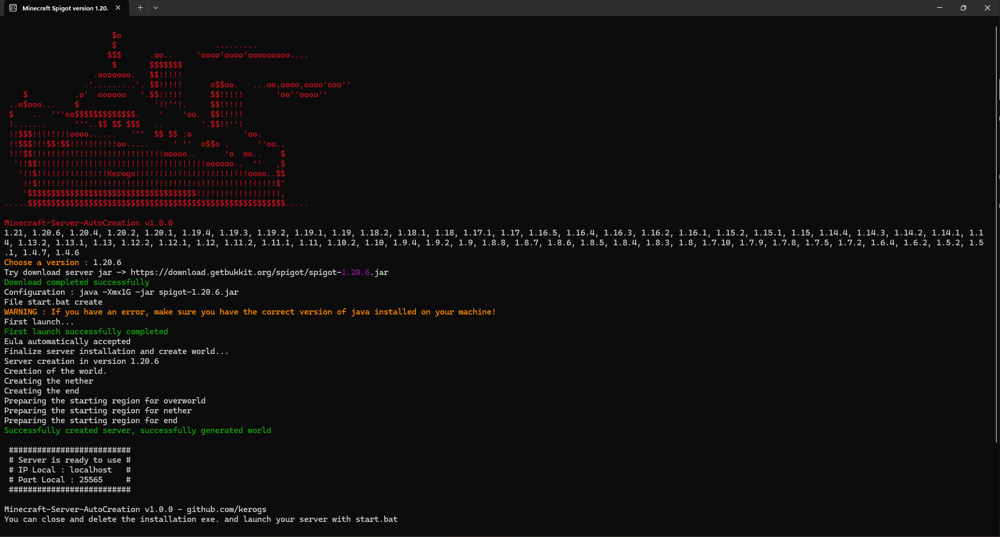

# Minecraft-Server-AutoCreation

<h3>MSAC - Minecraft Server AutoCreation</h3>

<em>Program to automatically create a minecraft server under spigot for all available versions*.</em>

## Introduction

MSAC (or Minecraft Server AutoCreation for short) is a program for automatically creating minecraft servers under spigot (for plugins). It supports all spigot versions of minecraft.

The program automatically downloads the required files directly from the official spigot website. (for example, the jar file to create the server).

Language used :

## How to use

- Download the latest version of MSAC -> [Latest version](https://github.com/kerogs/Minecraft-Server-AutoCreation/releases/latest)
- Launch exe file
- Select version (the program will list the versions available to you (automatically updated))
- let the server create itself from A to Z

## Features

- Select the desired server version
- Download jar file on its own
- Create bat file by itself
- launch first run automatically
- Accept EULA automatically (make sure you've read them!)
- Create all server files alone
- Track program actions to see what it's doing (with nice colors ✨)

## Preview Screenshot

## Future updates to work on

- Choose between Spigot or vanilla
- repair known issues
- auto download lastest java if not installés
- auto update java if deprecated
- propose when server is installed if user want turn off online mod

## Known issues

- Some spigot versions crash at different times, sometimes when the .jar file is downloaded, sometimes when the .bat file is launched, etc....
<!-- - No known issues -->

## Know issues (programming section)

- Windows Defender sometimes detects the executable as a virus. If this is the case, simply update the dependencies in go.mod

## To find out more
- If you want to know more about the program's security, you can go directly to the [SECURITY](security.md) section.
- If you would like to participate in the development of the program, you can find out more in the [CODE_OF_CONDUCT](CODE_OF_CONDUCT.md) section.
- the program is under [MIT](LICENSE) license